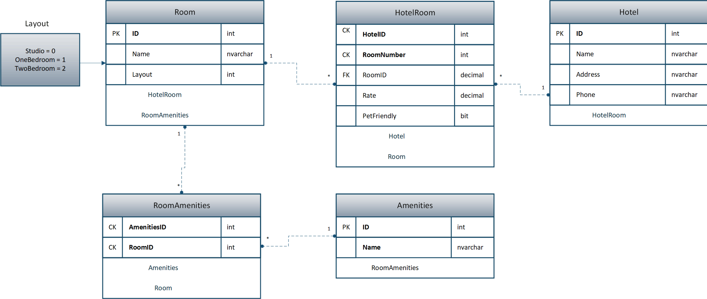
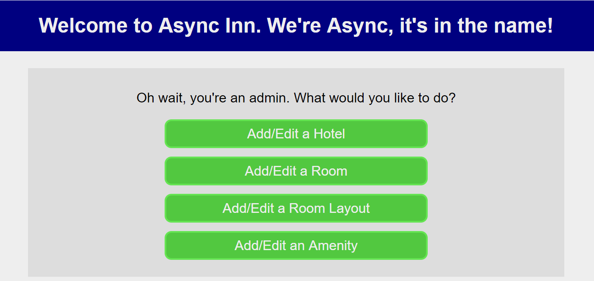

# Async Inn

This is a simple web app that was built to help familiarize ourselves with the Entity Core framework. It allows for simple CRUD operations on multiple data.

Deployment site:
https://innasync.azurewebsites.net/

## Database Schema

## Database Relations
- **Room** - Holds room layout type as an enumerable (studio, oneBed, twoBed). It has a one to many relationship to HotelRoom.

- **Hotel** - Holds properties name, address, and phone. It has a one to many relationship to HotelRoom.

- **HotelRoom** - This table holds a composite key made from a primary and a foreign key. It also has properties such as rate and pet friendliness. It has a many to one relationship to Room and Hotel.

- **Amenities** - This table holds the name property of a certain amenity. It has a one to many relationship with RoomAmenities.

- **RoomAmenities** - This acts as a pure join table consisting of keys only, and represents a many to many relationship between two tables. It has a many to one relationship with Amenities and Room.

## Getting Started

Clone down the repository, and navigate to the folder containing AsyncInn.sln. Open the project file with Visual Studio, and run the application with `IIS Express` (The green 'Play' button located under the 'Window' tab).

## Visual

